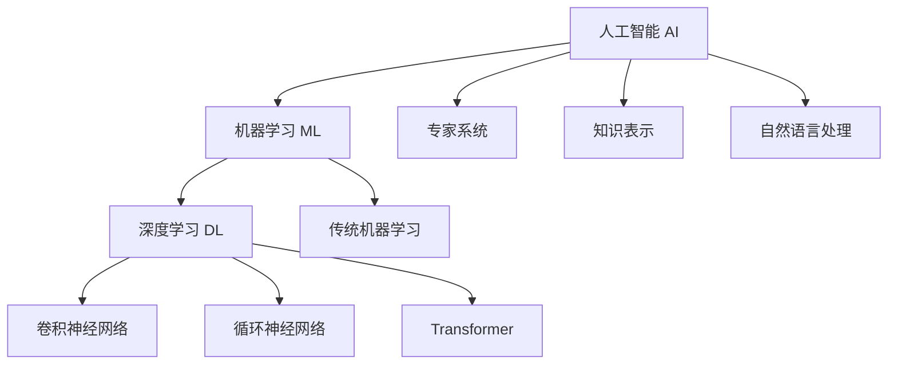

# 1.2 机器学习是什么

## 机器学习的定义

机器学习是人工智能的一个重要分支，它使计算机能够在没有明确编程的情况下进行学习。机器学习专注于开发算法和统计模型，使计算机系统能够有效地执行特定任务，而无需使用明确的指令，仅依靠模式和推理。

> **核心思想**：让机器从数据中自动学习规律，而不是人工编写规则。

## 机器学习与传统编程的区别

### 传统编程模式
```
数据 + 程序 → 输出
```

程序员编写具体的逻辑规则，计算机按照这些规则处理数据产生结果。

### 机器学习模式
```
数据 + 输出 → 程序（模型）
```

机器从大量的数据和期望的输出中学习规律，自动生成能够处理新数据的模型。

## 机器学习的核心要素

机器学习系统通常包含以下几个核心要素：

### 1. 数据（Data）
- **训练数据**：用于训练模型的历史数据
- **测试数据**：用于评估模型性能的数据
- **特征**：描述数据的属性或变量

### 2. 算法（Algorithm）
- **学习算法**：从数据中提取模式的方法
- **优化算法**：调整模型参数的技术
- **评估算法**：衡量模型性能的指标

### 3. 模型（Model）
- **参数**：模型中可调整的数值
- **超参数**：控制学习过程的设置
- **架构**：模型的结构和组织方式

### 4. 目标函数（Objective Function）
- **损失函数**：衡量预测与真实值之间差异
- **优化目标**：模型要最大化或最小化的指标

## 机器学习的主要类型

### 监督学习（Supervised Learning）
使用标记的训练数据来学习从输入到输出的映射关系。

**特点**：
- 有明确的输入-输出对
- 目标是学习一个函数来预测新数据的输出

**应用场景**：
- 图像分类
- 语音识别
- 房价预测
- 垃圾邮件检测

### 无监督学习（Unsupervised Learning）
在没有标记数据的情况下发现数据中的隐藏模式和结构。

**特点**：
- 只有输入数据，没有期望输出
- 目标是发现数据的内在结构

**应用场景**：
- 聚类分析
- 异常检测
- 推荐系统
- 数据降维

### 强化学习（Reinforcement Learning）
通过与环境交互来学习最优行为策略。

**特点**：
- 通过试错学习
- 基于奖励和惩罚机制
- 考虑长期收益

**应用场景**：
- 游戏AI
- 自动驾驶
- 机器人控制
- 资源调度

## 机器学习与人工智能的关系



- **人工智能**是最大的概念，包括所有让机器表现出智能行为的技术
- **机器学习**是实现人工智能的重要途径之一
- **深度学习**是机器学习的一个分支，特别在处理复杂模式方面表现突出

## 机器学习的发展历程

### 1950年代 - 起源阶段
- Alan Turing提出图灵测试
- 感知机的发明

### 1980年代 - 复兴时期
- 反向传播算法的发明
- 专家系统的兴起

### 2000年代 - 大数据时代
- 互联网普及带来海量数据
- 支持向量机等算法成熟

### 2010年代至今 - 深度学习时代
- GPU加速计算
- 大规模神经网络
- 预训练模型和迁移学习

---

> **总结**：机器学习是让计算机从数据中自动学习规律的技术，它改变了传统的编程范式，使得计算机能够处理以前无法解决的复杂问题。 